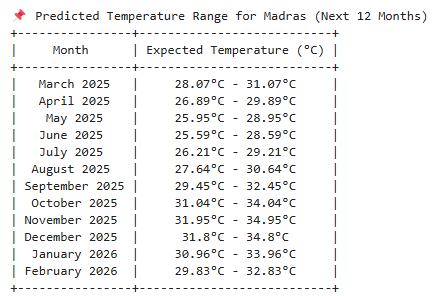

# 🌍 Climate Change Prediction Using Time Series Analysis
This project leverages deep learning and time series analysis to predict future temperature trends for cities worldwide. Using an LSTM model trained on historical climate data, it provides insights into temperature variations, helping to understand long-term climate patterns.

# 🚀 Features
📍 Dynamic City Selection – Predict temperatures for any major city  
📆 Monthly Forecasts – Predict temperature trends for up to 12 months  
🌡 Temperature Range Estimation – Displays expected min-max temperatures  

# 📊 Sample Prediction

